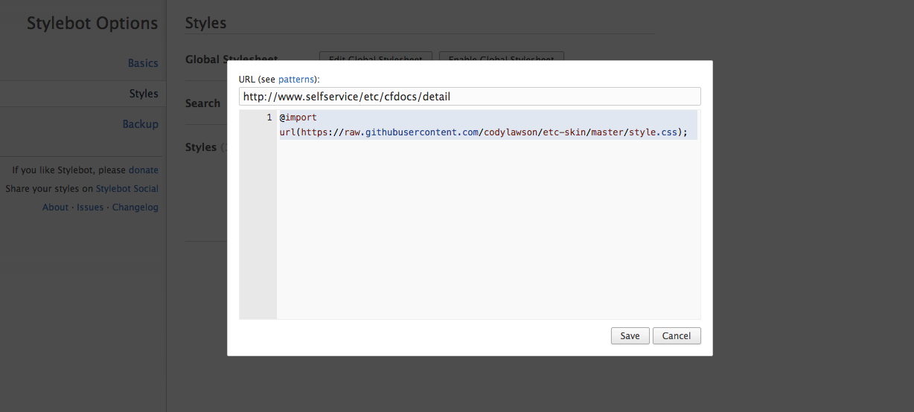
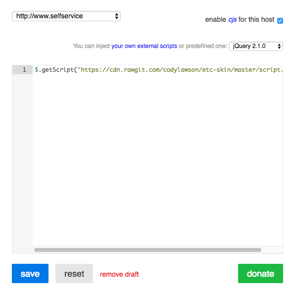

# ETC-Skin

An alternate skin for the electronic time card webapp used by esri.

Features:
- View related wbs numbers
- View project details
- Fluid layout that takes advantage of larger screens
- Improved ui including larger, and prettier buttons, and icons

##Requirements
There are two chrome extensions needed to apply the theme:
- [Stylebot](https://chrome.google.com/webstore/detail/stylebot/oiaejidbmkiecgbjeifoejpgmdaleoha?hl=en): Loads custom css stylesheet for any website.
- [CJS](https://chrome.google.com/webstore/detail/custom-javascript-for-web/poakhlngfciodnhlhhgnaaelnpjljija?hl=en): Runs some custom javascript on the page after load.

##Installation
1. Open the Stylebot options menu and go to the "Styles" tab.
2. Click "Add New Style" and paste this url http://www.selfservice/etc/cfdocs/detail into the first input.
3. Paste the following css into the code box and click "Add".
```
@import url(https://cdn.rawgit.com/codylawson/etc-skin/master/style.css);
```

4. Navigate to [ETC](http://www.selfservice/etc/cfdocs/detail) and login.
5. Open the CJS menu and make sure "enable cjs for this host" is selected.
6. Select jQuery 2.1.0 from the select box.
7. Paste the following javascript into the code box and click "Save".
```
$.getScript("https://cdn.rawgit.com/codylawson/etc-skin/master/script.js");
```

8. Refresh ETC.

For questions or help email me at clawson@esri.com
