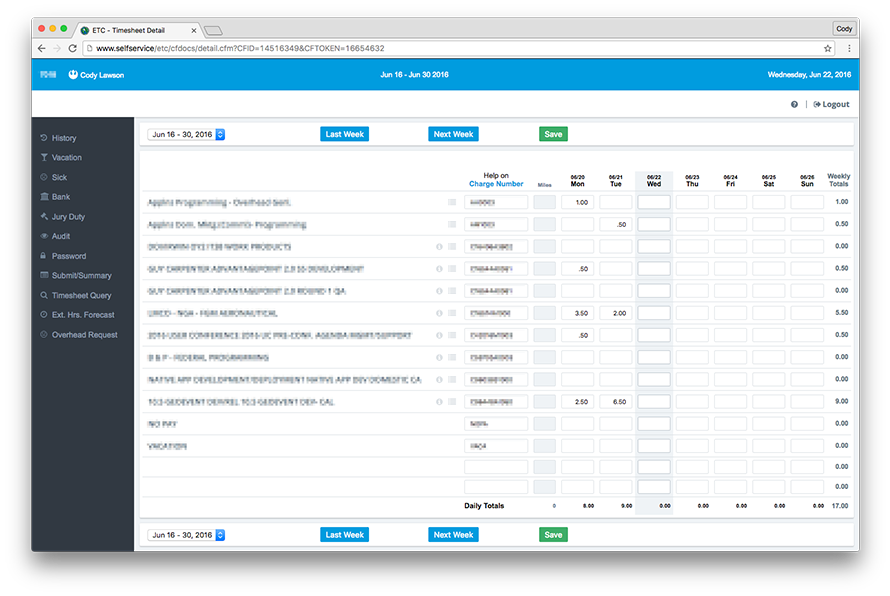

#ETC+ Chrome Extension

An alternate skin for the electronic time card webapp used by esri.

Features:
- Rename WBS descriptions
- View related wbs numbers
- View project details
- Fluid layout that takes advantage of larger screens
- Improved ui including larger, and prettier buttons, and icons

##Installation
Install the chrome extension from the chrome web store. [ETC+ Chrome Extension](https://chrome.google.com/webstore/detail/etc%20/bmcnmedpggkjdhcikejkebeidkidploo?hl=en&gl=US)

For questions or help email me at clawson@esri.com
